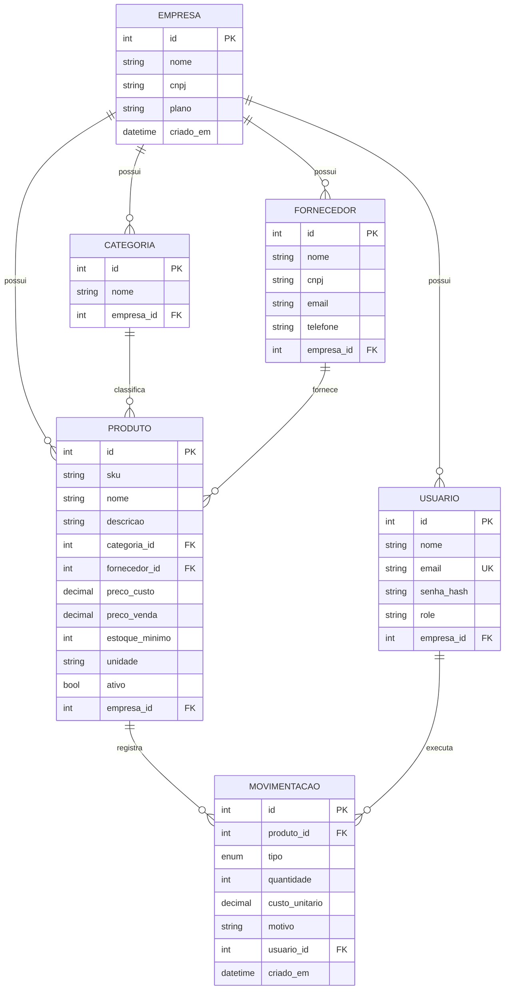

# back-end-cp-python

# Gestor de Estoque — API

API REST para controle de estoque de pequeno comércio. Permite cadastrar produtos, categorias e fornecedores, registrar entradas e saídas, e acompanhar saldo, custo médio e alertas de ruptura.

Projeto acadêmico desenvolvido para a FIAP — Tecnologia em Inteligência Artificial.

---

## Integrantes

| Nome | RM | GitHub |
|---|---|---|
| Felipe Terra | RM______ | [@terrafelipe](https://github.com/terrafelipe) |
| Gustavo Pugas Linczuk | RM573087 | [@gulinczuk](https://github.com/usuario) |
| _Nome do integrante_ | RM______ | [@usuario](https://github.com/usuario) |
| _Nome do integrante_ | RM______ | [@usuario](https://github.com/usuario) |

---

## Stack

| Camada | Tecnologia |
|---|---|
| Linguagem | Python 3.13 |
| Framework web | Flask |
| API e documentação | flask-restx (Swagger/OpenAPI) |
| ORM | SQLAlchemy |
| Migrations | Alembic (via Flask-Migrate) |
| Banco de dados | SQLite |
| Autenticação | JWT (Flask-JWT-Extended) |
| Hash de senha | bcrypt |

O SQLite foi escolhido por eliminar dependência de servidor externo, mantendo migrations versionadas e integridade referencial. Os modelos usam apenas tipos genéricos do SQLAlchemy, de modo que a migração para PostgreSQL exija apenas a troca da string de conexão.

---

## Como rodar

Pré-requisito: Python 3.11 ou superior.

```bash
# 1. Clonar o repositório
git clone https://github.com/<usuario>/<repositorio>.git
cd <repositorio>

# 2. Criar e ativar o ambiente virtual
python -m venv venv
source venv/bin/activate        # Linux / macOS
venv\Scripts\activate           # Windows

# 3. Instalar as dependências
pip install -r requirements.txt

# 4. Configurar as variáveis de ambiente
cp .env.example .env

# 5. Criar o banco
flask db upgrade

# 6. Popular com dados de demonstração (opcional)
python seed.py

# 7. Subir a aplicação
python run.py
```

A API sobe em `http://localhost:5000`.
A documentação interativa fica em **`http://localhost:5000/swagger`**.

### Variáveis de ambiente

| Variável | Descrição | Padrão |
|---|---|---|
| `FLASK_ENV` | Ambiente de execução | `development` |
| `SECRET_KEY` | Chave da aplicação | — |
| `JWT_SECRET_KEY` | Chave de assinatura dos tokens | — |
| `DATABASE_URL` | String de conexão | `sqlite:///estoque.db` |
| `JWT_ACCESS_TOKEN_EXPIRES` | Validade do token, em minutos | `60` |

### Usuários de demonstração

Criados pelo `seed.py`:

| Email | Senha | Perfil |
|---|---|---|
| `admin@demo.com` | `admin123` | admin |
| `operador@demo.com` | `operador123` | operador |

---

## Estrutura do projeto

```
app/
├── __init__.py        # application factory
├── config.py          # configuração por ambiente
├── extensions.py      # db, migrate, jwt
├── errors.py          # tratamento centralizado de erros
├── models/            # entidades SQLAlchemy
├── schemas/           # modelos de entrada e saída do flask-restx
├── services/          # regras de negócio
└── resources/         # rotas HTTP
migrations/            # histórico de migrations
seed.py                # dados de demonstração
run.py                 # ponto de entrada
```

A arquitetura separa responsabilidades em três camadas: os *resources* apenas recebem a requisição e devolvem a resposta, os *services* concentram toda a regra de negócio, e os *models* cuidam da persistência. Nenhuma validação de domínio ocorre na camada HTTP.

---

## Modelo de dados



### Decisões de modelagem

**O saldo não é armazenado.** Não existe coluna `saldo` em `produto` — o valor é derivado da soma das movimentações do item. A escolha evita estado duplicado e a possibilidade de o saldo divergir do histórico que o originou. Caso a leitura se torne custosa, o caminho previsto é adicionar um cache de saldo, tratado explicitamente como desnormalização por desempenho.

**Multi-tenant desde o início.** Toda entidade de domínio carrega `empresa_id`. Isolar dados por empresa depois que o sistema já tem uso é retrabalho considerável, e essa coluna também sustenta o modelo de planos previsto para etapas seguintes.

**Movimentação como registro imutável.** Movimentações formam a trilha de auditoria do estoque; alterá-las destruiria a capacidade de investigar divergências de inventário.

---

## Regras de negócio

| Código | Regra | Justificativa |
|---|---|---|
| **RN-01** | O SKU é único dentro de cada empresa | Identificador operacional do produto; duplicidade inviabiliza a conferência física |
| **RN-02** | Saída não pode resultar em saldo negativo | Saldo negativo representa a venda de item inexistente |
| **RN-03** | A quantidade informada é sempre positiva; o sentido vem do campo `tipo` | Evita ambiguidade entre sinal numérico e tipo de operação |
| **RN-04** | Movimentações não podem ser editadas nem excluídas; correções usam o tipo `AJUSTE` | Preserva a trilha de auditoria |
| **RN-05** | Produto com movimentação registrada não é excluído, apenas inativado | Exclusão quebraria o histórico que referencia o item |
| **RN-06** | Produto com saldo abaixo do estoque mínimo é sinalizado como em ruptura | Antecipa a reposição antes da falta |
| **RN-07** | O custo médio ponderado é recalculado a cada entrada | Base para valorização do estoque e apuração de margem |
| **RN-08** | O usuário acessa apenas dados da própria empresa, determinados pelo token | Isolamento entre clientes; validado no servidor, nunca por parâmetro do cliente |

Violações de regra de negócio retornam **HTTP 422** com o código correspondente na resposta.

---

## Endpoints

### Autenticação

| Método | Rota | Descrição |
|---|---|---|
| `POST` | `/auth/register` | Cadastra empresa e usuário administrador |
| `POST` | `/auth/login` | Autentica e retorna o token JWT |
| `GET` | `/auth/me` | Dados do usuário autenticado |

### Produtos

| Método | Rota | Descrição |
|---|---|---|
| `GET` | `/produtos` | Lista paginada, com filtros `busca`, `categoria_id` e `em_ruptura` |
| `POST` | `/produtos` | Cadastra produto |
| `GET` | `/produtos/{id}` | Detalha o produto, incluindo o saldo atual |
| `PUT` | `/produtos/{id}` | Atualiza produto |
| `DELETE` | `/produtos/{id}` | Inativa o produto |
| `GET` | `/produtos/{id}/movimentacoes` | Histórico do produto |

### Categorias e fornecedores

| Método | Rota |
|---|---|
| `GET` `POST` | `/categorias` · `/fornecedores` |
| `GET` `PUT` `DELETE` | `/categorias/{id}` · `/fornecedores/{id}` |

### Movimentações e estoque

| Método | Rota | Descrição |
|---|---|---|
| `GET` | `/movimentacoes` | Extrato com filtros `produto_id`, `tipo`, `de` e `ate` |
| `POST` | `/movimentacoes` | Registra entrada, saída ou ajuste |
| `GET` | `/estoque/saldo` | Saldo consolidado de todos os produtos |
| `GET` | `/estoque/alertas` | Produtos abaixo do estoque mínimo |

Todos os endpoints, exceto `/auth/register` e `/auth/login`, exigem o cabeçalho `Authorization: Bearer <token>`.

---

## Padrões da API

**Códigos de status**

| Código | Uso |
|---|---|
| `200` | Leitura ou atualização bem-sucedida |
| `201` | Recurso criado |
| `204` | Exclusão bem-sucedida |
| `400` | Requisição malformada |
| `401` | Token ausente ou inválido |
| `403` | Sem permissão para o recurso |
| `404` | Recurso inexistente |
| `422` | Regra de negócio violada |

**Formato de erro**, idêntico em toda a API:

```json
{
  "erro": {
    "codigo": "RN-02",
    "mensagem": "Saída de 50 unidades excede o saldo disponível de 12 unidades.",
    "campo": "quantidade"
  }
}
```

**Formato de listagem**, idêntico em todos os recursos paginados:

```json
{
  "itens": [],
  "pagina": 1,
  "por_pagina": 20,
  "total": 137,
  "total_paginas": 7
}
```

Os campos do JSON seguem `snake_case`. Senhas nunca aparecem em respostas — os modelos de entrada e saída são declarados separadamente.

---

## Escopo

Esta etapa entrega o backend, a documentação e a persistência. Estão previstos para as próximas: interface web e dashboard, aplicação de LLM, testes automatizados, containerização e deploy.

Estão deliberadamente **fora do escopo** do produto: emissão de documento fiscal, integração com marketplaces, controle multi-armazém e rastreio por lote ou número de série.

---

## Gestão do projeto

O acompanhamento das sprints é feito em [inserir link do Trello ou Notion].

---

## Licença

Uso acadêmico.
